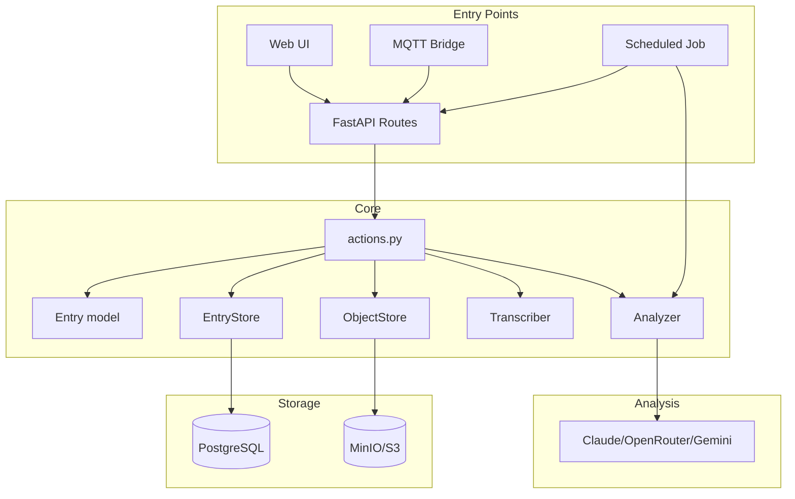
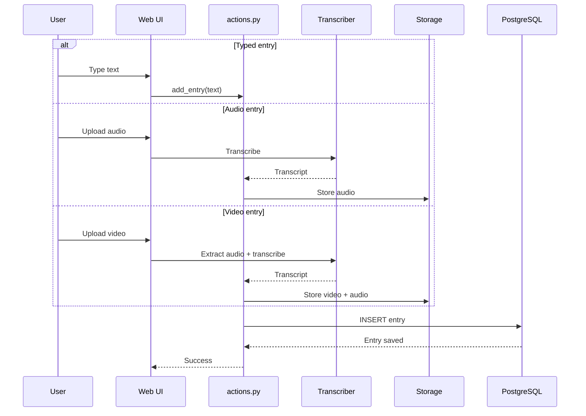
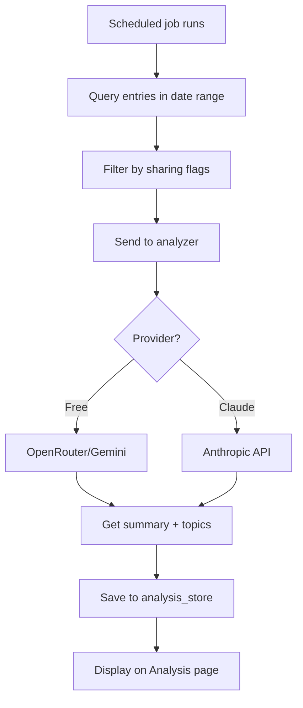

# landonkea-soliloquy — Design & Workflow

## High-Level Overview

## Entry Creation Flow

## Analysis Flow

## File Relationships

| File | Purpose | Used By |
|------|---------|---------|
| `src/soliloquy/entry.py` | Entry data model | Everything |
| `src/soliloquy/actions.py` | Core operations | Web, MQTT, Scheduler |
| `src/soliloquy/storage.py` | PostgreSQL store | Actions |
| `src/soliloquy/object_storage.py` | S3/MinIO store | Actions |
| `src/soliloquy/transcriber.py` | Whisper transcription | Actions |
| `src/soliloquy/analyzer.py` | AI analysis | Actions |
| `src/soliloquy/web/` | FastAPI app | User |
| `mqtt_bridge.py` | MQTT listener | makeItSoNumberOne |
| `scheduler.py` | Background analysis | Cron |
| `docker-compose.yml` | Postgres + MinIO + Mosquitto | Docker |

## draw.io

[Open in draw.io](https://app.diagrams.net/#RSoliloquy%20architecture)
